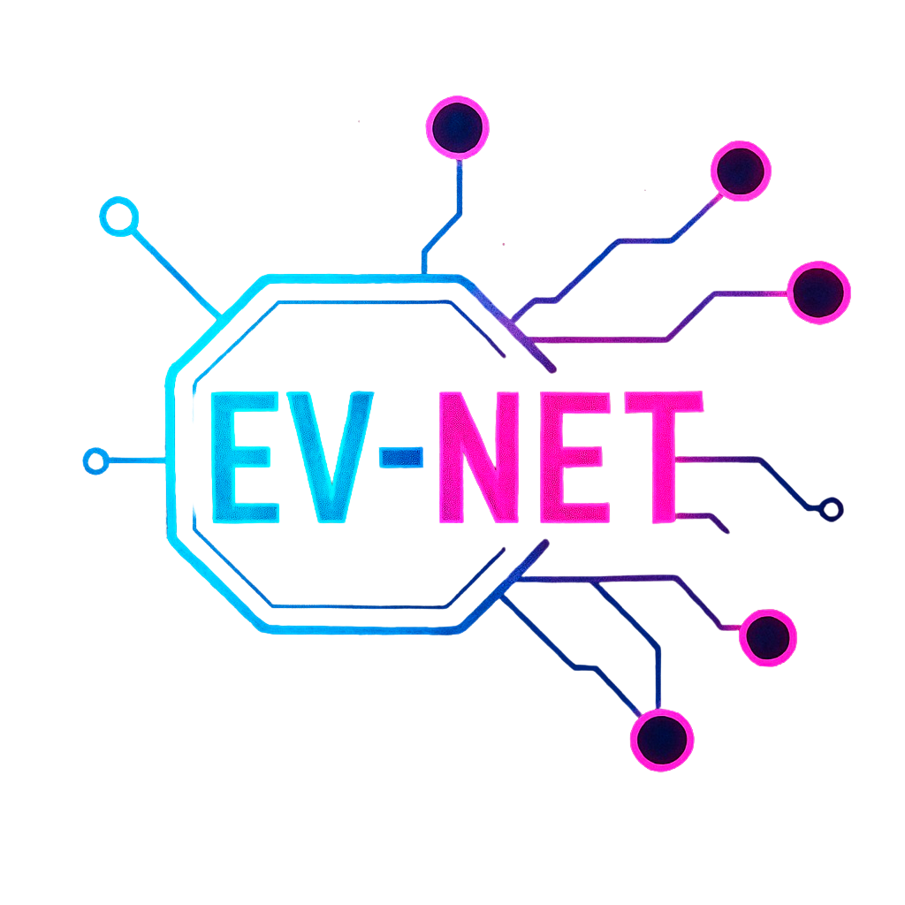

---
output:
  github_document:
    html_preview: true
---

<!-- README.md is generated from README.Rmd. Please edit that file -->

<!-- github markdown built using
rmarkdown::render("README.Rmd",output_format = "md_document")
-->



**EV-Net: Extracellular vesicles-mediated intercellular communication networks.** EV-Net enables the exploration of how extracellular vesicles (EVs) cargo influences receiving tissues of interest.

## Installation

Installation typically takes a few minutes, depending on how many dependencies are already installed on your system. You can install EV-Net (and its required dependencies) directly from GitHub:


``` r
if(!requireNamespace("devtools", quietly = TRUE)) {
  install.packages("devtools") 
}

devtools::install_github("torrejoNia/EV-Net")
```

EV-Net has been tested on both Windows and Linux.
Most recently tested with R version 4.5.1.

## Learn more about EV-Net

For detailed documentation, tutorials, and examples, visit the:
👉 [Quarto EV-Net page](https://quarto.com)

## References

**Pre-print in preparation**

## Funding 

This project was supported by the EMBO Scientific Exchange Grant 10987, which enabled Estefania Torrejón (NOVA Medical School), supervised by Rita Machado de Oliveira and Rune Matthiesen, to carry out an exchange at the Systems Biomedicine Lab led by Anaïs Baudot at the Marseille Medical Genetics Institute.

Estefania Torrejón’s PhD fellowship is funded by the iNOVA4Health-FCT fellowship UI/BD/154345/2022.

Presentations in conferences were supported by the European Union Twining Project EVCA (Horizon GA n° 101079264) and International Society of Computational Biology Student Council (ISCB-SC).

