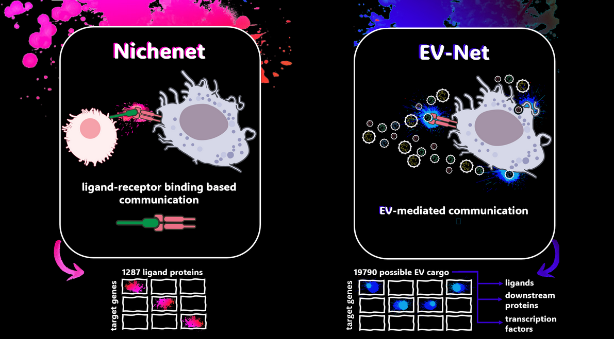

---
output:
  github_document:
    html_preview: true
---

<!-- README.md is generated from README.Rmd. Please edit that file -->

<!-- github markdown built using
rmarkdown::render("README.Rmd",output_format = "md_document")
-->

<p align="center">
  
</p>

**EV-Net: Extracellular vesicles-mediated intercellular communication networks.** EV-Net enables the exploration of how extracellular vesicles (EVs) cargo influences receiving tissues of interest.

## Installation

Installation typically takes a few minutes, depending on how many dependencies are already installed on your system. You can install EV-Net (and its required dependencies) directly from GitHub:

```{r gh-installation, eval = FALSE}
if(!requireNamespace("devtools", quietly = TRUE)) {
  install.packages("devtools") 
}

devtools::install_github("torrejoNIa/EV-Net")
```

EV-Net was tested on both Windows and Linux (most recently tested R version: R 4.5.1)

We would be submitting our package to Bioconductor in the near future.

## Overview of EV-Net
### Background

Extracellular vesicles (EVs) are small, bilayered vesicles that carry diverse bioactive molecules such as nucleic acids, proteins, and lipids. These vesicles play a crucial role in cell-to-cell communication, but their importance is often overlooked in communication network models. In addition to that, current tools available for studying these networks are not designed to handle EV-specific data.

To address this challenge, we adapted Nichenet (Browaeys et al., 2020), an existing framework for cell-to-cell communication exploration, for its use on EVs datasets. 

Originally, NicheNet was designed to analyze cell-to-cell communication by identifying ligands driving gene expression changes via ligand-receptor interactions. Since EVs can also deliver cargo through mechanisms beyond ligand-receptor interactions, such as membrane fusion and endocytosis, we modified NicheNet for its use on EVs. This modification expanded the tool’s scope to include not only ligands, but also dowsntream proteins proteins and transcription factors, ensuring a more comprehensive analysis of EV-mediated communication.
<br><br>

<br><br>

NicheNet utilizes a Personalized PageRank algorithm to generate a ligand-to-target scoring matrix. This process involves random walk restarts using each ligand as a seed node to obtain the scoring for each ligand-target diffusion. To tailor this method to our needs, we modified it and applied the algorithm to not only ligands, but also the downstream signaling proteins and transcription factors. This modification generated a new protein-to-target matrix comprising 19 790 proteins (spanning ligands, downstream proteins and transcription factors) and 22 521 target genes. This new  protein-to-target matrix replaced the original Nichenet ligand-to-target matrix, which only contained 1287 ligands and 22521 target genes.

### Main functionalities of EV-Net

* Assess the effect of EV cargo (proteins or transcripts) on gene expression in a receiving cell population across two conditions.
* Evaluate the potential impact of EV cargo (proteins or transcripts) on a receiving tissue under a single condition.
* Rank the EV cargo (proteins or transcripts) based on their predicted influence on gene expression.
* Infer putative EV cargo–target links active in the system under study.
* Predict potential signaling paths between EV cargo and target genes to generate causal hypotheses and identify supporting data sources.

### Input and Output

As input, EV-Net requires the EV cargo of interest (differentially abundant proteins or differentially expressed RNA obtained from EVs) and single-cell or sorted bulk data from the receiving tissue of interest, from either human or mouse. As output, EV-Net provides a ranking of EV cargo that best explains the changes in gene expression in the receiver tissue (when comparing two conditions) or identifies EV cargo with the strongest predicted effect on the receiving tissue, along with candidate target genes likely to be regulated by these EV cargo.

<p align="center">
  
</p>

<br><br>


<br><br>


## Tutorials

The following vignettes demonstrate how to perform a basic EV-Net analysis. We present two use cases, each with slightly different input data, but all aimed at exploring the effect of EV cargo on the receiving tissue of interest.

* [Use case 1: Effect of gut EVs in KC (Tabula Muris Atlas)](vignettes/Use_case_1_Effect_of_gut_EVs_in_KC_TabulaMurisAtlas.html)

* [Use case 2: Use case 2 Effect of LPC treated microglia EVs on microglia)](vignettes/Use_case_2_Effect_of_LPC_treated_microglia_EVs_on_microglia.html) 

## References

**Pre-print in preparation**

Nichenet: Browaeys, R., Saelens, W. & Saeys, Y. NicheNet: modeling intercellular communication by linking ligands to target genes. Nat Methods (2019) doi:10.1038/s41592-019-0667-5
