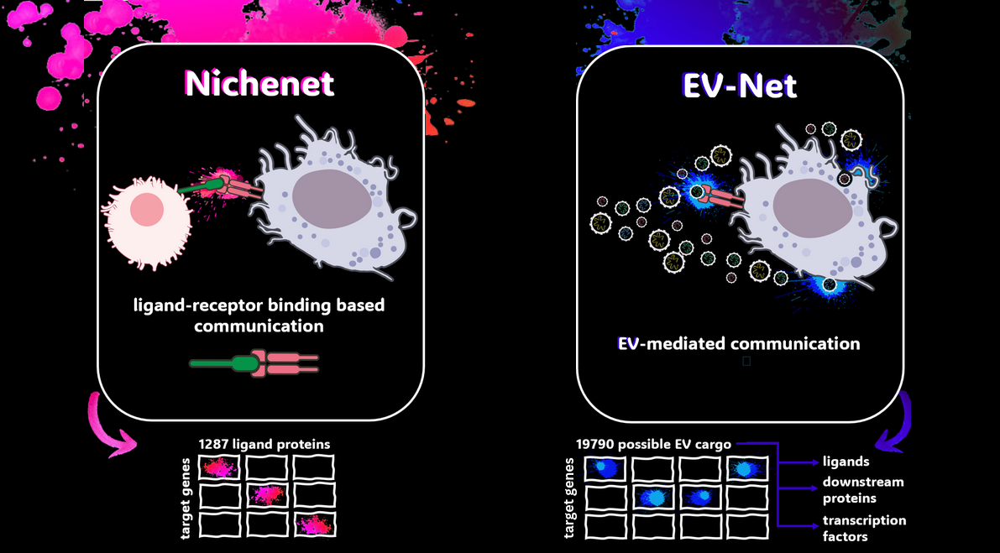
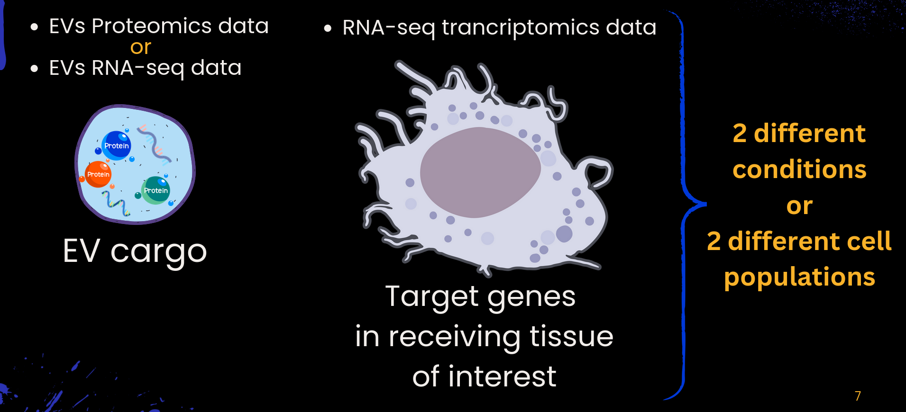

---
output:
  github_document:
    html_preview: true
---

<!-- README.md is generated from README.Rmd. Please edit that file -->

<!-- github markdown built using
rmarkdown::render("README.Rmd",output_format = "md_document")
-->

<p align="center">
  
</p>

**EV-Net: A computational framework to model extracellular vesicles-mediated communication.** 
EV-Net enables the identification and prioritization of EV cargo molecules with high 
regulatory potential in a recipient tissue of interest.

## Installation

EV-Net is an R package that requires R version 4.3.2 or higher for installation.

Installation time depends on the number of dependencies already installed. In our testing, it ranged from approximately 5 to 20 minutes. You can install EV-Net (and its required dependencies) directly from GitHub:

```{r gh-installation, eval = FALSE}
if(!requireNamespace("devtools", quietly = TRUE)) {
  install.packages("devtools") 
}

devtools::install_github("torrejoNia/EV-Net")

library(EVNet)
```

EV-Net has been tested on Windows, Linux and MacOS. Most recently tested with R version 4.5.2.

You can find the EV-Net source code on GitHub here → [EV-Net Github repo](https://github.com/torrejoNia/EV-Net) 

## Overview of EV-Net
### Background

Extracellular vesicles (EVs) are bilayer vesicles with diameters ranging from 40 to 5,000 nm that act as carriers of diverse bioactive molecules. Their EV cargo includes nucleic acids, proteins, and metabolites.
EVs are involved in a wide range of physiological and pathological processes, but their importance is often overlooked in communication network models. To the best of our knowledge, only one bioinformatic tool is currently available to assess EV-mediated CCC, miRTalk (Shao et al., 2025), which focuses specifically on communication driven by EVs-derived miRNAs.

To address this gap, we developed EV-Net, a computational framework that enables the exploration of the effect of EV cargo in their recipient tissues, using EVs proteomics or RNA-seq datasets. EV-Net was built by adapting NicheNet, an established  bioinformatics tool for CCC analysis that relies on ligand-receptor mediated communication (Browaeys et al., 2020). This adaptation involved extending the NicheNet scoring algorithm so that it could be applied not only to ligands but also to other proteins that may be transported as EV cargo. 
<br><br>

<br><br>

NicheNet utilizes a Personalized PageRank algorithm to generate a ligand-to-target scoring matrix. This algorithm involves random walk restarts using each ligand as a seed node to obtain the scoring for each ligand-target diffusion. In EV-Net, we modified this approach and applied the algorithm using not only ligands as seed nodes, but also transcription factors and intermediary signaling proteins. This modification generated a new protein-to-target matrix comprising 19,790 proteins (spanning ligands, downstream proteins and transcription factors) and 22,521 target genes. This new  protein-to-target matrix replaced the original NicheNet ligand-to-target matrix, which only contained 1287 ligands and 22521 target genes.

### Main functionalities of EV-Net

* Assess the effects of EV molecular cargo, including proteins or RNA transcripts, on gene expression in recipient tissues. It can compare two experimental conditions or a single condition across different cell populations.
* Prioritize EV cargo molecules (derived from proteomics or RNA-seq transcripts used as protein proxies) by ranking them according to their predicted regulatory potential on target gene expression.
* Infer putative EV cargo-target gene links specific to the recipient tissue under study.
* Predict potential signaling paths between EV cargo and target genes to generate hypotheses.

### Input and Output

As input, EV-Net takes EV cargo data provided as a list of protein names. These may correspond to differentially abundant proteins derived from EVs proteomics datasets or to differentially expressed transcripts obtained from EVs RNA-seq datasets used as proxy for proteins. For the recipient tissue of interest, users can provide a list of differentially expressed genes derived from pre-processed single-cell or bulk transcriptomic data or a Seurat object containing expression data for the recipient tissue across two conditions or two different cell populations. When a Seurat object is supplied, differential expression analysis can be performed directly within the EV-Net pipeline. Both human and mouse datasets are supported.

As output, EV-Net generates a ranked list of EV cargo molecules with the highest regulatory potential on the target genes, defined as the genes that best explain the observed changes in gene expression in the recipient tissue. In addition, the framework identifies candidate target genes that are likely to be regulated by the EV cargo, offering insights into putative EV-mediated regulatory mechanisms. These results are visualized as a regulatory potential matrix, where the prioritized EV cargo are displayed along the y-axis, target genes from the recipient tissue along the x-axis, and regulatory potential is represented by color intensity (Supplementary Figures 1 and 2). Users can further select highly ranked EV cargo molecules and their associated target genes to model signaling pathways (Supplementary Figure 3).


<p align="center">
  
</p>

<br><br>


<br><br>


## Tutorials

The following vignettes demonstrate how to perform a basic EV-Net analysis. We present two use cases, each with slightly different input data, but all aimed at exploring the effect of EV cargo on the receiving tissue of interest.

* [Use case 1: Effect of gut EVs in KC (Tabula Muris Atlas)](vignettes/Use_case_1_Effect_of_gut_EVs_in_KC_TabulaMurisAtlas.html)

* [Use case 2: Use case 2 Effect of LPC treated microglia EVs on microglia](vignettes/Use_case_2_Effect_of_LPC_treated_microglia_EVs_on_microglia.html) 

## Authors

[Estefania Torrejon](https://scholar.google.com/citations?user=c5RvnlUAAAAJ&hl=en&oi=ao), [Joeri Sleegers](https://scholar.google.com/citations?user=hRSv5kwAAAAJ&hl=en&oi=ao), [Rune Matthiesen](https://scholar.google.com/citations?user=tsjn1BcAAAAJ&hl=en&oi=ao), [Maria Paula Macedo](https://scholar.google.com/citations?user=qjZpKj0AAAAJ&hl=en&oi=ao), [Anaïs Baudot](https://scholar.google.com/citations?user=rzoYM1cAAAAJ&hl=en&oi=ao), [Rita Machado de Oliveira](https://scholar.google.com/citations?user=b55XP-oAAAAJ&hl=en&oi=ao)

## Funding

The core of this work was developed during the EMBO scientific exchange grant 10987 carried out by ET in AB lab. Additional work was supported by the Research Unit iNOVA4Health (UID/4462/2025) and by the Associated Laboratory LS4FUTURE (LA/P/0087/2020), both financially supported by Fundação para a Ciência e Tecnologia / Ministério da Educação, Ciência e Inovação, and the EVCA Twinning Project (Horizon GA n° 101079264) financially supported by the European Union. 

The aims of this study contribute to the ERDERA project (participant: AB), which has received funding from the European Union’s Horizon Europe research and innovation programme under grant agreement N°101156595. AB was also supported by France 2030 state funding managed by the National Research Agency with the reference "ANR-22-PESN-0013". RMO was supported by Fundação para a Ciência e a Tecnologia (2022.05764.PTDC). MPM was supported by the European Commission CORDIS Pas Gras Project (101080329). ET’s PhD fellowship is funded by the iNOVA4Health-FCT fellowship UI/BD/154345/202.

Presentations in conferences were supported by the European Union Twining Project EVCA (Horizon GA n° 101079264) and International Society of Computational Biology Student Council (ISCB-SC).

## References

**Pre-print in preparation**

NicheNet: Browaeys, R., Saelens, W. & Saeys, Y. NicheNet: modeling intercellular communication by linking ligands to target genes. Nat Methods (2019) doi:10.1038/s41592-019-0667-5

## If you have problems installing dependencies

Some systems may fail to install `ComplexHeatmap` and `Seurat` automatically when installing EV-Net, because they require additional repositories or dependencies.

Please install them manually first:

```{r dependencies, eval = FALSE}
# Install BiocManager if needed
install.packages("BiocManager") 
# Install ComplexHeatmap from Bioconductor
BiocManager::install("ComplexHeatmap") 

# Install Seurat and SeuratObject from CRAN
install.packages(c("SeuratObject", "Seurat"))
```

After that, install **EV-Net**:

```{r installation, eval = FALSE}
if(!requireNamespace("devtools", quietly = TRUE)) {
  install.packages("devtools") 
}

devtools::install_github("torrejoNia/EV-Net")
```
