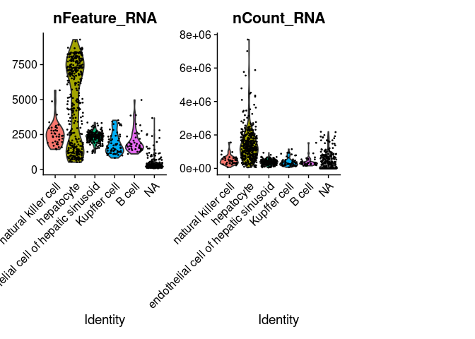
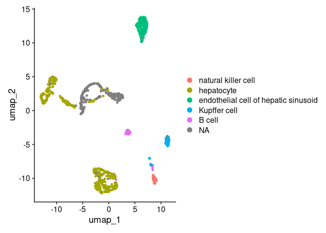
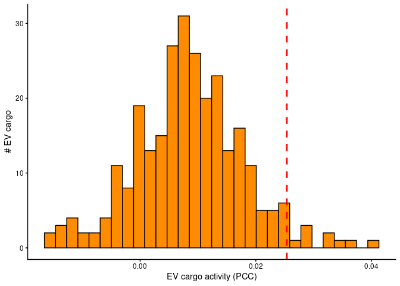
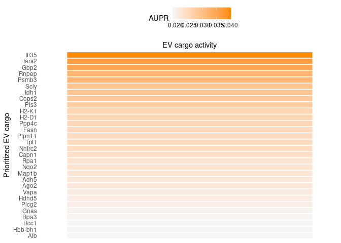
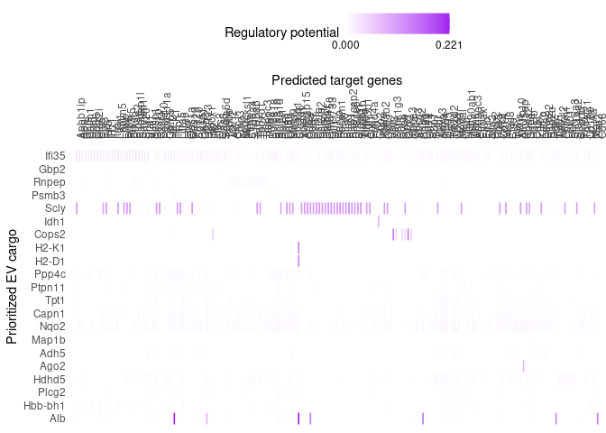

We applied EV-Net to investigate the impact of gut-derived EV cargo from
a prediabetic mouse model on the liver-resident macrophages, Kupffer
cells, as the recipient tissue of interest. We focused on genes that are
upregulated in Kupffer cells compared to hepatocytes.

### 0. Load required packages

    library(EVNet)
    library(Seurat)
    library(SeuratObject)
    library(tidyverse)
    library(dplyr)
    library(here)

**NOTE: If you encounter errors when loading Seurat or SeuratObject,
there may have been issues during package installation. Please refer to
the README section “If you have problems installing dependencies” and
install these dependencies manually.**

1.  Load filtered Seurat object

The dataset comes from the liver (FACS) subset of the Tabula Muris Atlas
(Tabula Muris Consortium, 2018). For quality control, we filtered the
Seurat object to retain only genes with at least 10 counts and expressed
in at least 5% of either the Kupffer cell or hepatocyte populations.

    options(timeout = 600)
    new_seurat_object <- readRDS(url("https://zenodo.org/record/15014486/files/filtered_seurat_obj_use_case_1.rds?download=1"))

### 2. Quality control of the filtered Seurat object

After filtering, we perform quality control on the new Seurat object to
explore the resulting subset of genes and assess the composition of cell
populations. **NOTE: SeuratObject version 5.1.0 or higher and Seurat
version 5.3.0 or higher are required to ensure proper execution of the
code chunks.**

    new_seurat_object@meta.data$cell_ontology_class %>% table() 

    ## .
    ##                               B cell endothelial cell of hepatic sinusoid 
    ##                                   41                                  182 
    ##                           hepatocyte                         Kupffer cell 
    ##                                  391                                   61 
    ##                  natural killer cell 
    ##                                   39

Visualize QC metrics using a violin plot

    VlnPlot(new_seurat_object, features = c("nFeature_RNA", "nCount_RNA"), ncol = 3)

    ## Warning: The `slot` argument of `FetchData()` is deprecated as of SeuratObject 5.0.0.
    ## ℹ Please use the `layer` argument instead.
    ## ℹ The deprecated feature was likely used in the Seurat package.
    ##   Please report the issue at <https://github.com/satijalab/seurat/issues>.
    ## This warning is displayed once per session.
    ## Call `lifecycle::last_lifecycle_warnings()` to see where this warning was
    ## generated.

    ## Warning: `PackageCheck()` was deprecated in SeuratObject 5.0.0.
    ## ℹ Please use `rlang::check_installed()` instead.
    ## ℹ The deprecated feature was likely used in the Seurat package.
    ##   Please report the issue at <https://github.com/satijalab/seurat/issues>.
    ## This warning is displayed once per session.
    ## Call `lifecycle::last_lifecycle_warnings()` to see where this warning was
    ## generated.

    ## Warning: `aes_string()` was deprecated in ggplot2 3.0.0.
    ## ℹ Please use tidy evaluation idioms with `aes()`.
    ## ℹ See also `vignette("ggplot2-in-packages")` for more information.
    ## ℹ The deprecated feature was likely used in the Seurat package.
    ##   Please report the issue at <https://github.com/satijalab/seurat/issues>.
    ## This warning is displayed once per session.
    ## Call `lifecycle::last_lifecycle_warnings()` to see where this warning was
    ## generated.

    ## Warning: annotation$theme is not a valid theme.
    ## Please use `theme()` to construct themes.

Visualize cell populations using UMAP

    DimPlot(new_seurat_object, reduction = "umap")

### 3. Subset cell populations of interest (Kupffer cells and hepatocytes)

In this step, we retain only the Kupffer cell and hepatocyte populations
for downstream analysis. This allows us to focus on only these two types
and reduce noise from other populations.

    seurat_obj <- subset(new_seurat_object,
            subset = cell_ontology_class %in% c("Kupffer cell", "hepatocyte"))

    ## Warning: Removing 267 cells missing data for vars requested

    Idents(object = seurat_obj) <- seurat_obj@meta.data$cell_ontology_class

### 4. Verify that only Kupffer cells and hepatocytes are retained

    seurat_obj@meta.data$cell_ontology_class %>% table() 

    ## .
    ##   hepatocyte Kupffer cell 
    ##          391           61

### 5. Load NicheNet networks from Zenodo

EV-Net relies on NicheNet’s weighted networks, which contain prior
knowledge about signaling and regulatory interactions. For this use
case, we are loading the networks required for a mouse organism.

    options(timeout = 600)
    organism <- "mouse"

    if(organism == "human"){
      lr_network <- readRDS(url("https://zenodo.org/record/7074291/files/lr_network_human_21122021.rds"))
      weighted_networks <- readRDS(url("https://zenodo.org/record/7074291/files/weighted_networks_nsga2r_final.rds?download=1"))
    } else if(organism == "mouse"){
      lr_network <- readRDS(url("https://zenodo.org/record/7074291/files/lr_network_mouse_21122021.rds"))
      weighted_networks <- readRDS(url("https://zenodo.org/record/7074291/files/weighted_networks_nsga2r_final_mouse.rds?download=1"))

    }

    lr_network <- lr_network %>% distinct(from, to)
    head(lr_network)

    ## # A tibble: 6 × 2
    ##   from          to   
    ##   <chr>         <chr>
    ## 1 2300002M23Rik Ddr1 
    ## 2 2610528A11Rik Gpr15
    ## 3 9530003J23Rik Itgal
    ## 4 a             Atrn 
    ## 5 a             F11r 
    ## 6 a             Mc1r

### 6. Download and load the EV-Net EV\_cargo\_target\_matrix

**Download it from
<https://zenodo.org/records/15019664/files/EV_cargo_target_matrix.rds>
and load it into your R environment.**

    EV_cargo_target_matrix <- readRDS("~/your_folder_name/EV_cargo_target_matrix.rds")
    #Replace file path with the path in which you stored the EV_cargo_target_matrix rds file

### 7. Define receiver cell populations and select shared genes

In this step we extract the cells for each population (Kupffer cells and
hepatocytes), get their count matrices, and identify the genes expressed
in at least one cell. The two lists of genes are then combined and
duplicates removed, producing a unified set of genes to be used for the
EV-Net workflow.

> **Note:** Add an identity class label (idents) for your cell
> populations

    # Step 1: Extract the cells belonging to each cell type
    cells_type_1 <- WhichCells(new_seurat_object, idents = "Kupffer cell")
    cells_type_2 <- WhichCells(new_seurat_object, idents = "hepatocyte")

    # Step 2: Subset the Seurat object to get the count matrix for each cell type
    data_matrix <- GetAssayData(new_seurat_object, slot = "counts")

    ## Warning: The `slot` argument of `GetAssayData()` is deprecated as of SeuratObject 5.0.0.
    ## ℹ Please use the `layer` argument instead.
    ## This warning is displayed once per session.
    ## Call `lifecycle::last_lifecycle_warnings()` to see where this warning was
    ## generated.

    # Get the features (genes) expressed in each cell type
    # Features expressed in at least one cell for cell_type_1 (Kupffer cells)
    features_type_1 <- rownames(data_matrix)[rowSums(data_matrix[, cells_type_1] > 0) > 0]

    # Features expressed in at least one cell for cell_type_2 (hepatocyte)
    features_type_2 <- rownames(data_matrix)[rowSums(data_matrix[, cells_type_2] > 0) > 0]

    # Step 3: Combine the two lists of features and remove duplicates
    combined_features <- unique(c(features_type_1, features_type_2))

Next, we define our receivers

    receiver = c("Kupffer cell", "hepatocyte")

    expressed_genes_receiver <- combined_features

### 8. Define expressed interactors and the potential EV cargo

In this step, we identify expressed interactors, which are all proteins
expressed in the receiving cell populations, including receptors,
downstream signaling proteins, and transcription factors, that could
potentially interact with the potential EV cargo (actual EV cargo will
be defined in a following step). These expressed interactors will be
used to link EV cargo to target genes in downstream analyses.

    all_genes <- unique(rownames(EV_cargo_target_matrix))  
    expressed_interactors <- intersect(all_genes, expressed_genes_receiver)

    lr_sig <- weighted_networks[["lr_sig"]]
    gr <- weighted_networks[["gr"]]

    potential_EV_cargo_prot <- lr_sig[lr_sig$to %in% expressed_interactors, "from"]
    potential_EV_cargo_tf <- gr[gr$to %in% expressed_interactors, "from"]
    potential_EV_cargo <- unique(c(potential_EV_cargo_prot$from, potential_EV_cargo_tf$from))

### 9. Reduce the size of the EV\_cargo\_target\_matrix

**Optional.** The EV\_cargo\_target\_matrix is large (3.6 GB). If your
system has limited RAM, it is recommended to filter the matrix to keep
only the expressed genes in the receiver and the potential EV cargo,
which significantly reduces its size. This step is optional for systems
with 32 GB of RAM or more.

    EV_cargo_target_matrix <- EV_cargo_target_matrix[rownames(EV_cargo_target_matrix) %in% expressed_genes_receiver, colnames(EV_cargo_target_matrix) %in% potential_EV_cargo]

Release memory using the garbage collector

    gc()

    ##             used   (Mb) gc trigger   (Mb)  max used   (Mb)
    ## Ncells   4151522  221.8    7563568  404.0   7563568  404.0
    ## Vcells 292537226 2231.9  888023146 6775.1 738350920 5633.2

### 10. Load the differentially abundant prediabetic EV cargo

We selected EVs proteins after a differential abundance analysis by an
empirical Bayes moderated t-test implemented in limma (Ritchie et al.,
2015). Specifically, proteins with a p-value &lt; 0.1 and a log fold
change &gt; 1 corresponding to the most abundant in the prediabetic
condition. These filtered prediabeteic EV cargo will be used to assess
their regulatory potential on the Kupffer cells.

    prediabetic_EV_cargo <- readRDS(url("https://zenodo.org/record/17041035/files/prediabetic_EV_cargo.rds"))

### 11. Get list of EV\_cargo

The final set of EV cargo is obtained by selecting proteins that are
present in both the actual prediabetic EV cargo and the list of
potential EV cargo (obtained in step 8). This ensures that we focus on
proteins that are differentially abundant in the prediabetic condition
and that may influence the expressed genes in the receiving tissue.

    EV_cargo <- intersect(potential_EV_cargo, prediabetic_EV_cargo)

### 12. Define the gene set of interest

To define the gene set of interest, we use Seurat’s `FindMarkers()`
function to assess differential expression between our cell populations.
Genes with an average log2 fold change `(avg_log2FC) ≥ 0.25` and an
`adjusted p-value <= 0.05` are selected as upregulated in Kupffer cells.

    condition_oi <-  "Kupffer cell"
    condition_reference <- "hepatocyte"

    seurat_obj_receiver <- subset(seurat_obj, idents = receiver)

    DE_table_receiver <-  FindMarkers(object = seurat_obj,
                                      ident.1 = condition_oi, ident.2 = condition_reference,
                                      group.by = "cell_ontology_class",
                                      min.pct = 0.05) %>% rownames_to_column("gene")

    geneset_oi <- DE_table_receiver %>% filter(p_val_adj <= 0.05 & avg_log2FC >= 0.25) %>% pull(gene)
    geneset_oi <- geneset_oi %>% .[. %in% rownames(EV_cargo_target_matrix)]

### 13. Defining background genes

Background genes are all genes expressed in the receiving cell
populations. They provide a reference set for statistical analyses and
enrichment calculations.

    background_expressed_genes <- expressed_genes_receiver %>% .[. %in% rownames(EV_cargo_target_matrix)]

### 14. Perform EV cargo activity analysis

    EV_cargo_activities <- predict_EV_cargo_activities(geneset = geneset_oi,
                                                   background_expressed_genes = background_expressed_genes,
                                                   EV_cargo_target_matrix = EV_cargo_target_matrix,
                                                   potential_EV_cargo = EV_cargo)

    EV_cargo_activities <- EV_cargo_activities %>% arrange(-aupr_corrected) %>% mutate(rank = rank(desc(aupr_corrected)))
    EV_cargo_activities

    ## # A tibble: 275 × 6
    ##    test_EV_cargo auroc  aupr aupr_corrected pearson  rank
    ##    <chr>         <dbl> <dbl>          <dbl>   <dbl> <dbl>
    ##  1 Ifi35         0.561 0.154         0.0403 0.0959      1
    ##  2 Iars2         0.564 0.150         0.0368 0.0888      2
    ##  3 Gbp2          0.562 0.148         0.0350 0.0838      3
    ##  4 Rnpep         0.564 0.145         0.0318 0.0764      4
    ##  5 Psmb3         0.561 0.145         0.0317 0.0776      5
    ##  6 Scly          0.567 0.142         0.0289 0.0401      6
    ##  7 Idh1          0.564 0.142         0.0285 0.0466      7
    ##  8 Cops2         0.558 0.141         0.0278 0.00679     8
    ##  9 Pls3          0.552 0.140         0.0272 0.0675      9
    ## 10 H2-K1         0.547 0.139         0.0254 0.0466     10
    ## # ℹ 265 more rows

### 15. Visualization of top-ranked EV cargo

    p_hist_EV_cargo_activity <- ggplot(EV_cargo_activities, aes(x=aupr_corrected)) + 
      geom_histogram(color="black", fill="darkorange")  + 
      geom_vline(aes(xintercept=min(EV_cargo_activities %>% top_n(10, aupr_corrected) %>% pull(aupr_corrected))),
                 color="red", linetype="dashed", size=1) + 
      labs(x="EV cargo activity (PCC)", y = "# EV cargo") +
      theme_classic()

    ## Warning: Using `size` aesthetic for lines was deprecated in ggplot2 3.4.0.
    ## ℹ Please use `linewidth` instead.
    ## This warning is displayed once per session.
    ## Call `lifecycle::last_lifecycle_warnings()` to see where this warning was
    ## generated.

    p_hist_EV_cargo_activity

### 16. We can also visualize the EV cargo activity measure (AUPR) of these top-ranked EV cargo

> **Note:** We have selected the top 30 `best_upstream_EV_cargo` but
> this number can be changed.

    best_upstream_EV_cargo <- EV_cargo_activities %>% top_n(30, aupr_corrected) %>% arrange(-aupr_corrected) %>% pull(test_EV_cargo)

    vis_EV_cargo_aupr <- EV_cargo_activities %>% filter(test_EV_cargo %in% best_upstream_EV_cargo) %>%
      column_to_rownames("test_EV_cargo") %>% select(aupr_corrected) %>% arrange(aupr_corrected) %>% as.matrix(ncol = 1)

    (make_heatmap_ggplot(vis_EV_cargo_aupr,
                         "Prioritized EV cargo", "EV cargo activity", 
                         legend_title = "AUPR", color = "darkorange") + 
        theme(axis.text.x.top = element_blank()))  

    ## Warning: The `size` argument of `element_line()` is deprecated as of ggplot2 3.4.0.
    ## ℹ Please use the `linewidth` argument instead.
    ## This warning is displayed once per session.
    ## Call `lifecycle::last_lifecycle_warnings()` to see where this warning was
    ## generated.

### 17. Infer Kupffer cell’s target genes of top-ranked EV cargo

    active_EV_cargo_target_links_df <- best_upstream_EV_cargo %>%
      lapply(get_weighted_EV_cargo_target_links,
             geneset = geneset_oi,
             EV_cargo_target_matrix = EV_cargo_target_matrix,
             n = 80) %>%
      bind_rows() %>% drop_na()

    active_EV_cargo_target_links <- prepare_EV_cargo_target_visualization(
      EV_cargo_target_df = active_EV_cargo_target_links_df,
      EV_cargo_target_matrix = EV_cargo_target_matrix,
      cutoff = 0.5) 

    order_EV_cargo <- intersect(best_upstream_EV_cargo, colnames(active_EV_cargo_target_links)) %>% rev()
    order_targets <- active_EV_cargo_target_links_df$target %>% unique() %>% intersect(rownames(active_EV_cargo_target_links))

    vis_EV_cargo_target <- t(active_EV_cargo_target_links[order_targets,order_EV_cargo])

    target_genes_heatmap <- make_heatmap_ggplot(vis_EV_cargo_target, "Prioritized EV cargo", "Predicted target genes",
                        color = "purple", legend_title = "Regulatory potential") +
      scale_fill_gradient2(low = "whitesmoke",  high = "purple", breaks = range(vis_EV_cargo_target, na.rm = TRUE), labels = scales::label_number(accuracy = 0.001))

    target_genes_heatmap

Save plot (optional)

    png("target_genes_heatmap_prediabetic_EV_cargo_target_matrix_newHyper.png", res = 300, width = 5600, height = 2000)
    print(target_genes_heatmap)

### 18. Build an interaction network

Next, we build an interaction network for one of the top-ranked EV
cargo, the Scly protein, and two of its biologically relevant target
genes for prediabetes: Zeb2 and Foxo1. These targets were selected after
examining the `target_genes_heatmap` and performing a small literature
search, to prioritize genes with potential functional significance.

Load Nichenet’s sig\_network and gr\_network from zenodo

    sig_network <- readRDS(url("https://zenodo.org/records/7074291/files/signaling_network_mouse_21122021.rds"))
    gr_network <- readRDS(url("https://zenodo.org/records/7074291/files/gr_network_mouse_21122021.rds"))

Infer EV\_cargo-to-target signaling paths

    EV_cargo_oi <- "Scly"
    targets_oi <- c("Zeb2", "Foxo1")

    active_signaling_network <- get_EV_cargo_signaling_path(EV_cargo_all = EV_cargo_oi,
                                                          targets_all = targets_oi, 
                                                          weighted_networks = weighted_networks,
                                                          EV_cargo_tf_matrix = EV_cargo_target_matrix,
                                                          top_n_regulators = 4,
                                                          minmax_scaling = TRUE) 

    graph_min_max <- diagrammer_format_signaling_graph(signaling_graph_list = active_signaling_network,
                                                       EV_cargo_all = EV_cargo_oi, targets_all = targets_oi,
                                                       sig_color = "indianred", gr_color = "steelblue")

    DiagrammeR::render_graph(graph_min_max, layout = "tree")

    # To export/draw the svg, you need to install DiagrammeRsvg
    #graph_svg <- DiagrammeRsvg::export_svg(DiagrammeR::render_graph(graph_min_max, layout = "tree", output = "graph"))
    #cowplot::ggdraw() + cowplot::draw_image(charToRaw(graph_svg))

**Optional:** Create a dataframe with annotations of collected data
sources supporting the interactions in this network.

    data_source_network <- infer_supporting_datasources(signaling_graph_list = active_signaling_network,
                                                        lr_network = lr_network, sig_network = sig_network, gr_network = gr_network)
    head(data_source_network) 

    ## # A tibble: 6 × 5
    ##   from  to    source                   database       layer     
    ##   <chr> <chr> <chr>                    <chr>          <chr>     
    ## 1 Cebpb Foxo1 harmonizome_CHEA         harmonizome_gr regulatory
    ## 2 Cebpb Foxo1 harmonizome_ENCODE       harmonizome_gr regulatory
    ## 3 Cebpb Foxo1 regnetwork_source        regnetwork     regulatory
    ## 4 Cebpb Zeb2  harmonizome_ENCODE       harmonizome_gr regulatory
    ## 5 Cebpb Zeb2  harmonizome_TRANSFAC_CUR harmonizome_gr regulatory
    ## 6 Cebpb Zeb2  ontogenet_coarse         ontogenet      regulatory
