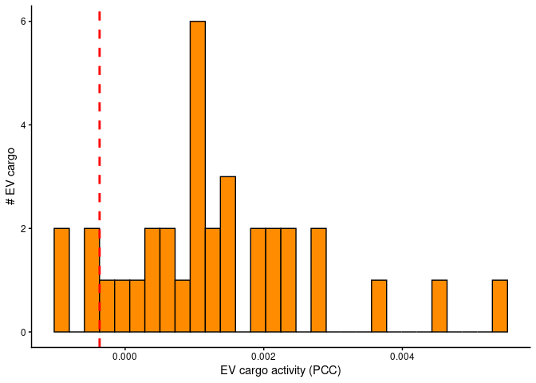
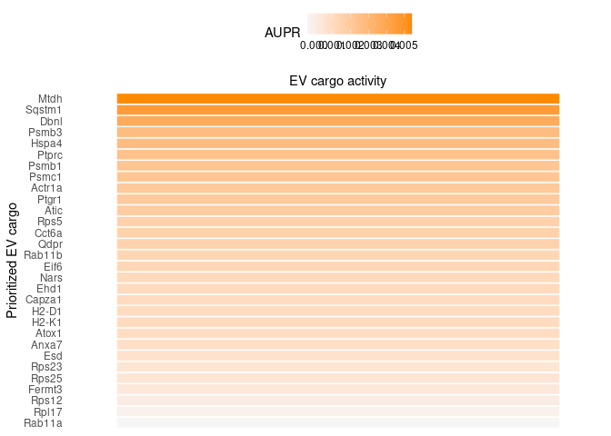
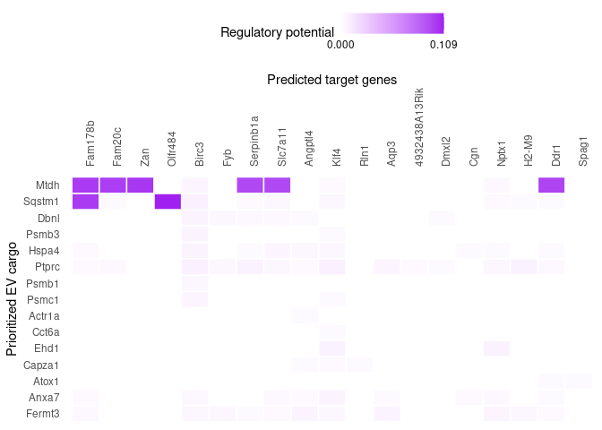

This use case explores the the effect of EVs released by
lipopolysaccharide (LPS)-activated microglia on unstimulated (naïve)
microglia. LPS induces a pro-inflammatory phenotype in microglia, the
brain’s resident immune cells, which play a central role in mediating
neuroinflammatory responses across various neurological disorders
(Santiago et al., 2023).

### 0. Load required packages

    library(EVNet)
    library(tidyverse)
    library(dplyr)
    library(here)

### 1. Load microglia EVs proteomics file

The dataset used in this vignette originates from Santiago et
al. (2023), “Identification of State-Specific Proteomic and
Transcriptomic Signatures of Microglia-Derived Extracellular Vesicles.”
It comprises proteomics data from EVs derived from LPS-activated
microglia and RNA-seq data from recipient unstimulated (naïve) microglia
exposed to these EVs.

    LPS_microglia_EVs <- read.csv(url("https://zenodo.org/records/17391831/files/LPS_microglia_EVs.csv?download=1"), stringsAsFactors = FALSE)

### 2. Extracting the LPS\_EV\_cargo (more abundant in LPS treated microglia)

Santiago and colleagues performed a differential abundance analysis
using unpaired t-tests to compare EVs proteomics data from control
microglia vs. LPS-activated microglia and other experimental conditions.
Proteins that were more abundant in EVs from LPS-activated microglia and
showed p-values &lt; 0.1 were selected as the LPS\_EV\_cargo for our
analysis.

    LPS_EV_cargo <- LPS_microglia_EVs %>%
      filter(diff.LPS.Control > 0, Pr..F. < 0.1) %>%
      pull(X)

### 3. Importing receiving microglia expression dataset

As input data for the recipient tissue, we utilized transcriptomics data
from naïve microglia exposed to LPS-activated microglia-derived EVs
provided in the same study by Santiago et al., 2023.

    receiving_microglia_expression <- readRDS(url("https://zenodo.org/records/17581185/files/receiving_microglia_expression.rds?download=1"))

### 4. Defining expressed genes in receiving microglia

    expressed_genes_receiver <- receiving_microglia_expression$UniProt

### 5. Loading Nichenet networks from Zenodo

EV-Net relies on NicheNet’s weighted networks, which contain prior
knowledge about signaling and regulatory interactions. For this use
case, we are loading the networks required for a mouse organism.

    options(timeout = 600)
    organism <- "mouse"

    if(organism == "human"){
      lr_network <- readRDS(url("https://zenodo.org/record/7074291/files/lr_network_human_21122021.rds"))
      weighted_networks <- readRDS(url("https://zenodo.org/record/7074291/files/weighted_networks_nsga2r_final.rds?download=1"))
    } else if(organism == "mouse"){
      lr_network <- readRDS(url("https://zenodo.org/record/7074291/files/lr_network_mouse_21122021.rds"))
      weighted_networks <- readRDS(url("https://zenodo.org/record/7074291/files/weighted_networks_nsga2r_final_mouse.rds?download=1"))
      
    }

    lr_network <- lr_network %>% distinct(from, to)
    head(lr_network)

    ## # A tibble: 6 × 2
    ##   from          to   
    ##   <chr>         <chr>
    ## 1 2300002M23Rik Ddr1 
    ## 2 2610528A11Rik Gpr15
    ## 3 9530003J23Rik Itgal
    ## 4 a             Atrn 
    ## 5 a             F11r 
    ## 6 a             Mc1r

### 6. Download and load the EV-Net EV\_cargo\_target\_matrix

**Download it from
<https://zenodo.org/records/15019664/files/EV_cargo_target_matrix.rds>
and load it into your R environment.**

    EV_cargo_target_matrix <- readRDS("~/your_folder_name/EV_cargo_target_matrix.rds")
    #Replace file path with the path in which you stored the EV_cargo_target_matrix rds file

### 7. Define expressed interactors and the potential EV cargo

In this step, we identify expressed interactors, which are all proteins
expressed in the receiving cell populations, including receptors,
downstream signaling proteins, and transcription factors, that could
potentially interact with the potential EV cargo (actual EV cargo will
be defined in a following step). These expressed interactors will be
used to link EV cargo to target genes in downstream analyses.

    all_genes <- unique(rownames(EV_cargo_target_matrix))  
    expressed_interactors <- intersect(all_genes, expressed_genes_receiver)

    lr_sig <- weighted_networks[["lr_sig"]]
    gr <- weighted_networks[["gr"]]

    potential_EV_cargo_prot <- lr_sig[lr_sig$to %in% expressed_interactors, "from"]
    potential_EV_cargo_tf <- gr[gr$to %in% expressed_interactors, "from"]
    potential_EV_cargo <- unique(c(potential_EV_cargo_prot$from, potential_EV_cargo_tf$from))

### 8. Reduce the size of the EV\_cargo\_target\_matrix

**Optional.** The EV\_cargo\_target\_matrix is large (3.6 GB). If your
system has limited RAM, it is recommended to filter the matrix to keep
only the expressed genes in the receiver and the potential EV cargo,
which significantly reduces its size. This step is optional for systems
with 32 GB of RAM or more.

    EV_cargo_target_matrix <- EV_cargo_target_matrix[rownames(EV_cargo_target_matrix) %in% expressed_genes_receiver, colnames(EV_cargo_target_matrix) %in% potential_EV_cargo]

Release memory using the garbage collector

    gc()

    ##             used   (Mb) gc trigger   (Mb)  max used   (Mb)
    ## Ncells   1367137   73.1    2289185  122.3   2289185  122.3
    ## Vcells 217668894 1660.7  638545723 4871.8 663481717 5062.0

### 9. Define the gene set of interest

To define the gene set of interest, we focused on naïve microglia genes
that were differentially expressed in the condition treated with
LPS-activated microglia-derived EVs, based on an adjusted p-value &lt;
0.1 `padj < 0.1` and an absolute log fold change &gt;= 0.25
`(avg_log2FC) ≥ 0.25`.

    geneset_oi <- receiving_microglia_expression %>%
      filter(padj < 0.1 & abs(log2FoldChange) >= 0.25) %>%
      pull(UniProt)

    geneset_oi <- geneset_oi %>% .[. %in% rownames(EV_cargo_target_matrix)]

### 10. Defining background genes

Background genes are all genes expressed in the recipient (naïve
microglia). They provide a reference set for statistical analyses and
enrichment calculations.

    background_expressed_genes <- expressed_genes_receiver %>% .[. %in% rownames(EV_cargo_target_matrix)]

### 11. Get list of EV\_cargo

The final set of EV cargo is obtained by selecting proteins that are
present in both the actual LPS-activated microglia EV cargo and the list
of potential EV cargo (obtained in step 7). This ensures that we focus
on proteins that are differentially abundant in the LPS-activated
condition and that may influence the expressed genes in the naïve
receiving microglia.

    EV_cargo <- intersect(potential_EV_cargo, LPS_EV_cargo)

### 12. Perform EV cargo activity analysis

    EV_cargo_activities <- predict_EV_cargo_activities(geneset = geneset_oi,
                                                   background_expressed_genes = background_expressed_genes,
                                                   EV_cargo_target_matrix = EV_cargo_target_matrix,
                                                   potential_EV_cargo = EV_cargo)

    EV_cargo_activities <- EV_cargo_activities %>% arrange(-aupr_corrected) %>% mutate(rank = rank(desc(aupr_corrected)))

    EV_cargo_activities

    ## # A tibble: 34 × 6
    ##    test_EV_cargo auroc   aupr aupr_corrected  pearson  rank
    ##    <chr>         <dbl>  <dbl>          <dbl>    <dbl> <dbl>
    ##  1 Mtdh          0.524 0.0143        0.00541 0.0385       1
    ##  2 Sqstm1        0.503 0.0135        0.00453 0.00578      2
    ##  3 Dbnl          0.500 0.0127        0.00371 0.0104       3
    ##  4 Psmb3         0.497 0.0117        0.00274 0.0102       4
    ##  5 Hspa4         0.521 0.0117        0.00274 0.00571      5
    ##  6 Ptprc         0.538 0.0114        0.00242 0.00635      6
    ##  7 Psmb1         0.480 0.0112        0.00226 0.00155      7
    ##  8 Psmc1         0.496 0.0112        0.00224 0.00783      8
    ##  9 Actr1a        0.493 0.0110        0.00207 0.000736     9
    ## 10 Ptgr1         0.537 0.0109        0.00198 0.0154      10
    ## # ℹ 24 more rows

### 13. Visualization of top-ranked EV cargo

    p_hist_EV_cargo_activity <- ggplot(EV_cargo_activities, aes(x=aupr_corrected)) + 
      geom_histogram(color="black", fill="darkorange")  + 
      geom_vline(aes(xintercept=min(EV_cargo_activities %>% top_n(30, aupr_corrected) %>% pull(aupr_corrected))),
                 color="red", linetype="dashed", size=1) + 
      labs(x="EV cargo activity (PCC)", y = "# EV cargo") +
      theme_classic()

    ## Warning: Using `size` aesthetic for lines was deprecated in ggplot2 3.4.0.
    ## ℹ Please use `linewidth` instead.
    ## This warning is displayed once per session.
    ## Call `lifecycle::last_lifecycle_warnings()` to see where this warning was
    ## generated.

    p_hist_EV_cargo_activity

 \### 14. We can also visualize the EV cargo
activity measure (AUPR) of these top-ranked EV cargo &gt; **Note:** We
have selected the top 30 `best_upstream_EV_cargo` but this number can be
changed.

    best_upstream_EV_cargo <- EV_cargo_activities %>% top_n(30, aupr_corrected) %>% arrange(-aupr_corrected) %>% pull(test_EV_cargo)

    vis_EV_cargo_aupr <- EV_cargo_activities %>% filter(test_EV_cargo %in% best_upstream_EV_cargo) %>%
      column_to_rownames("test_EV_cargo") %>% select(aupr_corrected) %>% arrange(aupr_corrected) %>% as.matrix(ncol = 1)

    (make_heatmap_ggplot(vis_EV_cargo_aupr,
                         "Prioritized EV cargo", "EV cargo activity", 
                         legend_title = "AUPR", color = "darkorange") + 
        theme(axis.text.x.top = element_blank()))  

    ## Warning: The `size` argument of `element_line()` is deprecated as of ggplot2 3.4.0.
    ## ℹ Please use the `linewidth` argument instead.
    ## This warning is displayed once per session.
    ## Call `lifecycle::last_lifecycle_warnings()` to see where this warning was
    ## generated.

### 15. Infer target genes of top-ranked EV cargo

    active_EV_cargo_target_links_df <- best_upstream_EV_cargo %>%
      lapply(get_weighted_EV_cargo_target_links,
             geneset = geneset_oi,
             EV_cargo_target_matrix = EV_cargo_target_matrix,
             n = 80) %>%
      bind_rows() %>% drop_na()

    active_EV_cargo_target_links <- prepare_EV_cargo_target_visualization(
      EV_cargo_target_df = active_EV_cargo_target_links_df,
      EV_cargo_target_matrix = EV_cargo_target_matrix,
      cutoff = 0.5) 

    order_EV_cargo <- intersect(best_upstream_EV_cargo, colnames(active_EV_cargo_target_links)) %>% rev()
    order_targets <- active_EV_cargo_target_links_df$target %>% unique() %>% intersect(rownames(active_EV_cargo_target_links))

    vis_EV_cargo_target <- t(active_EV_cargo_target_links[order_targets,order_EV_cargo])

    target_genes_heatmap <- make_heatmap_ggplot(vis_EV_cargo_target, "Prioritized EV cargo", "Predicted target genes",
                        color = "purple", legend_title = "Regulatory potential") +
      scale_fill_gradient2(low = "whitesmoke",  high = "purple", breaks = range(vis_EV_cargo_target, na.rm = TRUE), labels = scales::label_number(accuracy = 0.001))

    target_genes_heatmap

 \### 16. Save plot (optional)

    png("target_genes_heatmap_microglia_EV_cargo_RNAseq.png", res = 300, width = 2000, height = 2000)
    print(target_genes_heatmap)

### 17. Build an interaction network

Next we will build an interaction network between one of the top-ranked
EV cargo: the Mtdh protein, and two of its targets with biological
relevance for inflammation: Ddr1 and Slc7a11 (choice was made after
studying the target\_genes\_heatmap and performing a small literature
search).

Loading Nichenet’s sig\_network and gr\_network from zenodo

    sig_network <- readRDS(url("https://zenodo.org/records/7074291/files/signaling_network_mouse_21122021.rds"))
    gr_network <- readRDS(url("https://zenodo.org/records/7074291/files/gr_network_mouse_21122021.rds"))

Inferring EV\_cargo-to-target signaling paths

    EV_cargo_oi <- "Mtdh"
    targets_oi <- c("Ddr1", "Slc7a11")

    active_signaling_network <- get_EV_cargo_signaling_path(EV_cargo_all = EV_cargo_oi,
                                                          targets_all = targets_oi, 
                                                          weighted_networks = weighted_networks,
                                                          EV_cargo_tf_matrix = EV_cargo_target_matrix,
                                                          top_n_regulators = 3,
                                                          minmax_scaling = TRUE) 

    ## Warning in igraph::shortest_paths(signaling_igraph, from = EV_cargo_oi, : At
    ## vendor/cigraph/src/paths/dijkstra.c:534 : Couldn't reach some vertices.

    graph_min_max <- diagrammer_format_signaling_graph(signaling_graph_list = active_signaling_network,
                                                       EV_cargo_all = EV_cargo_oi, targets_all = targets_oi,
                                                       sig_color = "indianred", gr_color = "steelblue")

    DiagrammeR::render_graph(graph_min_max, layout = "tree")

    # To export/draw the svg, you need to install DiagrammeRsvg
    #graph_svg <- DiagrammeRsvg::export_svg(DiagrammeR::render_graph(graph_min_max, layout = "tree", output = "graph"))
    #cowplot::ggdraw() + cowplot::draw_image(charToRaw(graph_svg))

**Optional:** Create a dataframe with annotations of collected data
sources supporting the interactions in this network.

    data_source_network <- infer_supporting_datasources(signaling_graph_list = active_signaling_network,
                                                        lr_network = lr_network, sig_network = sig_network, gr_network = gr_network)
    head(data_source_network) 

    ## # A tibble: 6 × 5
    ##   from  to      source                                database             layer
    ##   <chr> <chr>   <chr>                                 <chr>                <chr>
    ## 1 Cebpd Slc7a11 harmonizome_CHEA                      harmonizome_gr       regu…
    ## 2 Cebpd Slc7a11 harmonizome_ENCODE                    harmonizome_gr       regu…
    ## 3 Cebpd Slc7a11 harmonizome_TRANSFAC_CUR              harmonizome_gr       regu…
    ## 4 Cebpd Slc7a11 pathwaycommons_controls_expression_of pathwaycommons_expr… regu…
    ## 5 Cebpd Slc7a11 KnockTF                               KnockTF              regu…
    ## 6 Il1b  Ddr1    NicheNet_LT_infrequent                NicheNet_LT          regu…
